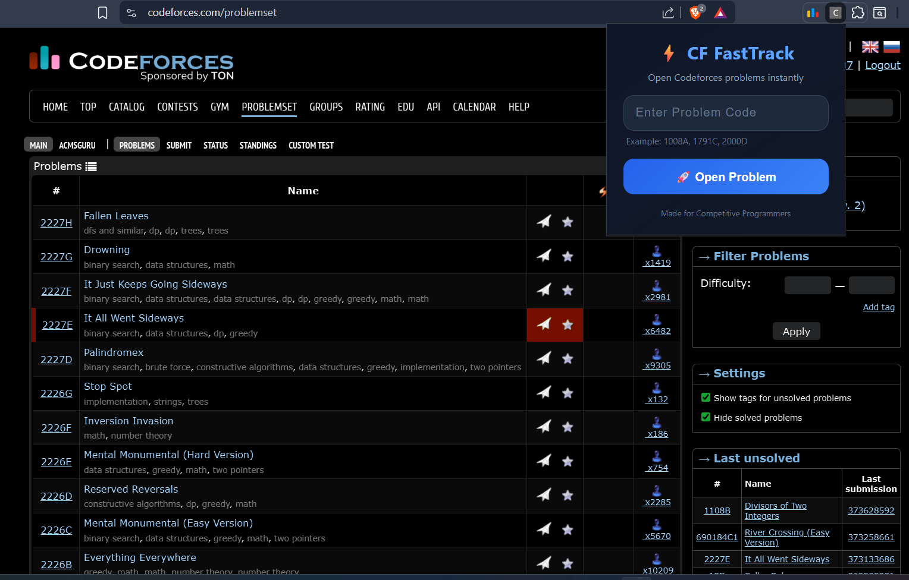

<p align="center">
  
</p>

<h1 align="center">⚡ CF FastTrack</h1>

<p align="center">
  Instantly open Codeforces problems using simple problem codes.
</p>

---

## 🚀 Features

- Instantly open Codeforces problems
- Modern dark-themed UI
- Direct problem code support
- Lightweight and fast
- Clean Chrome Extension Manifest V3 setup

### Supported Formats

```txt
1008A
1791C
2000D
```

---

## 📸 Preview

<p align="center">
  
</p>

---

## 🛠️ Tech Stack

- HTML
- CSS
- JavaScript
- Chrome Extension Manifest V3

---

## 📦 Installation

### 1. Clone the repository

```bash
git clone https://github.com/RISHIL0706/cf-fasttrack.git
```

### 2. Open Chrome Extensions

```txt
chrome://extensions/
```

### 3. Enable Developer Mode

Turn on the toggle at the top-right corner.

### 4. Load the Extension

- Click **Load unpacked**
- Select the `cf-fasttrack` folder

---

## 🎯 Usage

Enter a problem code like:

```txt
1008A
```

The extension automatically opens:

```txt
https://codeforces.com/problemset/problem/1008/A
```

---

## 🔥 Future Improvements

- Keyboard shortcuts
- Recently opened problems
- Contest search
- Invalid problem detection
- Codeforces API integration
- Solved problem tracking
- Custom themes
- Firefox support

---

## 📄 License

MIT License